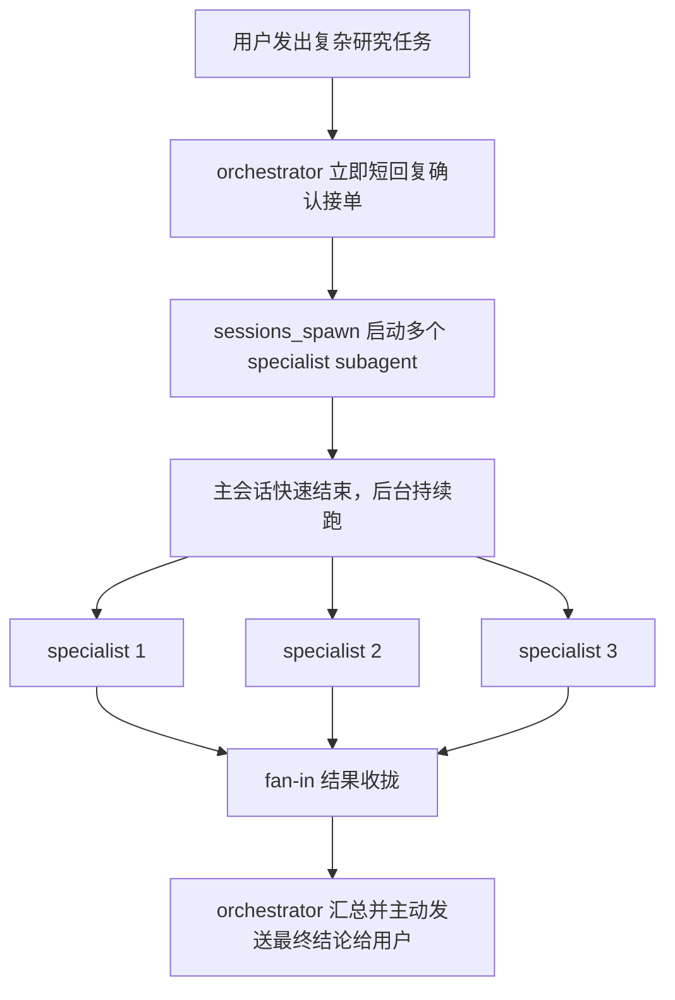
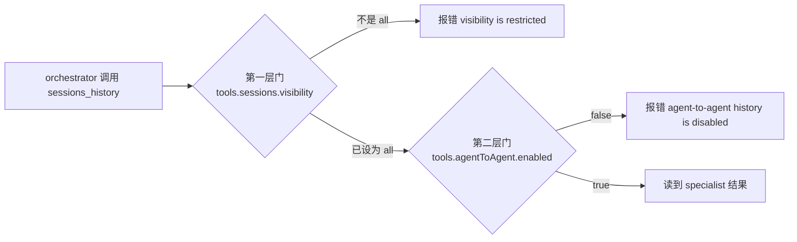
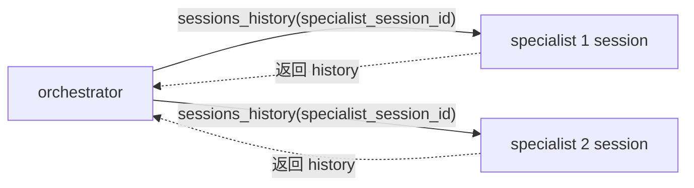
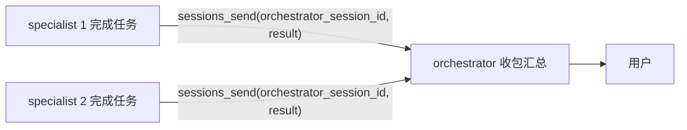

# OpenClaw 多 Agent 编排经验书

> [!IMPORTANT]
> 多 agent orchestration 的真正挑战不在于如何派工（fan-out），而在于如何稳定收包（fan-in）。当 worker 沉默时，先查 exec allowlist 与路径匹配，不要先怀疑 agent 本身。

| 项目 | 内容 |
| :--- | :--- |
| 整理日期 | 2026-04-03 |
| 适用场景 | 主 orchestrator agent 驱动多个 specialist subagent 并发执行任务 |
| 关键配置文件 | `~/.openclaw/openclaw.json` |
| 涉及工具 | `sessions_spawn` · `sessions_history` · `sessions_send` |
| 版本说明 | 本文为重新排版版本；初版存档见 [openclaw-multi-agent-orchestration-guide.md](./openclaw-multi-agent-orchestration-guide.md) |

---

## 目录

| # | 章节 | 一句话说明 |
| :--- | :--- | :--- |
| 1 | [本文目标](#1-本文目标) | 要在 OpenClaw 里做出什么能力 |
| 2 | [核心架构结论](#2-核心架构结论) | 接单与执行必须分离，fan-in 才是难点 |
| 3 | [三个关键阻塞与解决方案](#3-三个关键阻塞与解决方案) | 可见性、总开关、会话生效时机 |
| 4 | [fan-in 的两种架构方案](#4-fan-in-的两种架构方案) | 主动读取 vs 消息回传 |
| 5 | [Worker 沉默的诊断框架](#5-worker-沉默的诊断框架) | 四类失败的拆分顺序与实战案例 |
| 6 | [可复用的最终配置](#6-可复用的最终配置) | 直接抄的配置片段与验收顺序 |
| 7 | [Orchestrator 回复规范](#7-orchestrator-回复规范) | 接单、执行、停止、交付四个阶段 |
| 8 | [关键工程判断](#8-关键工程判断) | 三条可迁移的经验判断 |
| 9 | [一句话总结](#9-一句话总结) | 整篇压缩成一句 |

---

## 1. 本文目标

本文记录在 OpenClaw 中实现以下能力的完整工程经验：

1. 让**主 orchestrator agent** 能稳定驱动多个 specialist subagent 并发执行任务。
2. 让整个系统的交互方式适合真实生产场景：
   - 前台快速确认接单
   - 后台持续执行
   - 不因平台单次响应窗口而停工
   - 完成后主动回传最终结果

---

## 2. 核心架构结论

### 2.1 真正的问题是执行架构，不是让 agent 更努力

如果任务本身超过单次同步响应窗口，正确做法不是强行在一次回复里完成，而是：

- 先快速 ack（确认接单）
- 再转后台持久执行
- 完成后主动发新消息回传结果

> [!TIP]
> 同步回复只负责接单，真正工作放到后台 session。

### 2.2 orchestrator 的正确执行模式



### 2.3 fan-out 能力已可用，难点在 fan-in

| 环节 | 含义 | 现状 |
| :--- | :--- | :--- |
| fan-out | 派工给多个 specialist | OpenClaw 的 `sessions_spawn` 已经支持，实现相对简单 |
| fan-in | 汇总多个 specialist 的结果 | 从"能演示"到"可生产"的真正难点，涉及权限配置与架构选择 |

---

## 3. 三个关键阻塞与解决方案

下面三个阻塞按实际踩坑顺序排列，统一用「现象 → 根因 → 解决方案」呈现。

### 3.1 阻塞一：跨 session 可见性不足

**现象**：orchestrator 尝试通过 `sessions_history` 读取 specialist 的结果时报错。

```text
Session history visibility is restricted.
Set tools.sessions.visibility=all to allow cross-agent access.
```

**根因**：OpenClaw 默认 session 可见范围为 `tree`，不允许跨 agent 读取。

**解决方案**：修改 `~/.openclaw/openclaw.json`，将 visibility 改为 `all`。

```json
"tools": {
  "sessions": {
    "visibility": "all"
  }
}
```

`visibility` 可选值：

| 值 | 含义 |
| :--- | :--- |
| `self` | 只能读自己的 session |
| `tree` | 只能读自己及子 session（默认） |
| `agent` | 同一 agent 类型内可互读 |
| `all` | 跨 agent 全量可读 |

### 3.2 阻塞二：agent-to-agent 总开关默认关闭

**现象**：打开 `visibility=all` 之后，报错信息发生变化。

```text
Agent-to-agent history is disabled.
Set tools.agentToAgent.enabled=true to allow cross-agent access.
```

**根因**：跨 agent 历史访问有独立的总开关，默认关闭。

**解决方案**：继续修改同一配置文件，两项一起加上。

```json
"tools": {
  "agentToAgent": {
    "enabled": true
  },
  "sessions": {
    "visibility": "all"
  }
}
```

跨 agent 读取要连过两道门：



> [!IMPORTANT]
> 两个配置缺一不可：`visibility=all` 是第一层权限门，`agentToAgent.enabled=true` 是第二层。报错信息的变化本身就是权限逐层打开的证明。

### 3.3 阻塞三：配置写入 ≠ 当前会话立即生效

**现象**：配置文件已写入、gateway 服务也确认 running，但当前活跃 session 里仍然报旧错误。

**根因**：OpenClaw 的工具权限能力在 session 创建时固化，不对当前活跃会话做热更新。

**正确验收流程**：

1. 修改 `~/.openclaw/openclaw.json`
2. 重启或确认 gateway 服务状态正常

   ```bash
   openclaw gateway restart
   openclaw gateway status
   ```

3. **新开一个会话**，不要在原会话里测
4. 在新会话中实际调用目标工具
5. 以真实 tool 调用返回结果为准，不以配置文件内容为准

> [!WARNING]
> 不要把"文件已改"误判为"当前活跃会话一定已生效"。

---

## 4. fan-in 的两种架构方案

### 4.1 方案 A：direct collect（orchestrator 主动读取）



**前提条件**：

- `tools.sessions.visibility = "all"`
- `tools.agentToAgent.enabled = true`
- 需要在新会话中验证权限是否生效

**优点**：实现简单，orchestrator 主动控制。

**缺点**：依赖权限配置，跨环境迁移时容易踩权限门。

### 4.2 方案 B：消息式回传（specialist 主动 send）



**优点**：

- 权限边界清晰，不依赖读取别人的完整会话历史
- 更接近异步消息总线模型
- 更适合未来扩展团队规模

### 4.3 选型对照与建议

| 维度 | 方案 A direct collect | 方案 B 消息式回传 |
| :--- | :--- | :--- |
| 结果获取方式 | orchestrator 主动 `sessions_history()` | specialist 主动 `sessions_send()` |
| 权限依赖 | 需 `visibility=all` + `agentToAgent.enabled=true`，且需新会话验证 | 不依赖读取他人完整会话历史，权限边界清晰 |
| 优点 | 实现简单，orchestrator 主动控制 | 更接近异步消息总线模型，更适合扩展团队规模 |
| 风险 | 跨环境迁移时容易踩权限门 | — |

> [!TIP]
> 两套方案都准备。`direct collect` 能用时优先用；受限时自动回退到消息式回传。

---

## 5. Worker 沉默的诊断框架

在多 agent orchestration 中，当某个 specialist / worker 没有回传结果时，**不要直接怀疑模型能力**。

### 5.1 四类失败与诊断顺序

| # | 失败类型 | 诊断方法 |
| :--- | :--- | :--- |
| 1 | 未 claim 任务 | 查 worker session 是否收到任务 |
| 2 | 已 claim 但未执行 | 查 session 日志，看任务是否启动 |
| 3 | 已执行但未回传 | 查 session 结尾，看有无回传动作 |
| 4 | **被 exec allowlist 拦截** | 查 session 是否有 `Blocked: exec denied: allowlist miss` |

### 5.2 实战案例：worker 被 exec allowlist 拦截

**现象**：4 个 worker 中，3 个正常回传，1 个无响应。lead 多次 broadcast 和定向催办均无效。

**真实根因**：该 worker 并非"不会做"，而是执行回传动作时被 OpenClaw exec allowlist 拦截。

```text
Blocked: exec denied: allowlist miss
```

表象是 worker 没响应，本质是 exec policy path mismatch。

**修复方法**：在 exec approvals 里为 agent 补上显式 allowlist 路径。

```text
~/.local/bin/clawteam
~/bin/clawteam
```

> [!TIP]
> 不要只依赖通配规则（如 `*/clawteam`）。实测表明，显式路径 allowlist 更稳，可以降低 spawned worker 环境下的路径解析偏差。

---

## 6. 可复用的最终配置

如果要启用 orchestrator 直接读取 specialist session history，`~/.openclaw/openclaw.json` 至少需要包含：

```json
{
  "tools": {
    "agentToAgent": {
      "enabled": true
    },
    "sessions": {
      "visibility": "all"
    }
  }
}
```

配置完成后，按以下顺序验收：

1. 确认文件已写入
2. 确认服务正常

   ```bash
   openclaw gateway restart
   openclaw gateway status
   ```

3. 新开会话
4. 实际调用 `sessions_history` 看返回结果
5. 以真实返回为准

---

## 7. Orchestrator 回复规范

### 7.1 接单时

- 只做一句短确认，不展开过程
- 示例：`已转后台持续研究，完成后直接回你最终结论。`

### 7.2 执行时

- 不在前台反复刷状态
- 后台驱动 specialist，不因平台超时或上下文接近极限而停工

### 7.3 只允许停止执行的情况

- 已拿到可交付结论
- 出现必须由人类决策的阻塞
- 外部权限或工具失败且无法自恢复

### 7.4 交付时的结构化输出

1. **Executive Conclusion**（核心结论）
2. **核心证据**
3. **风险与失效条件**
4. **置信度**

---

## 8. 关键工程判断

### 8.1 三层状态要分清

处理 OpenClaw 权限类配置时，必须区分：

| 层 | 判断内容 | 验证方式 |
| :--- | :--- | :--- |
| 文件层 | 配置是否写入 | 直接读配置文件 |
| 服务层 | gateway 是否已读取 | `openclaw gateway status` |
| 会话层 | 当前 session tool capability 是否刷新 | 新开会话 + 实际 tool call |

只看其中一层，会误判状态。

### 8.2 worker silent 是症状，不是结论

`worker silent` 意味着需要进一步诊断，不等于"agent 不稳定"或"模型有问题"。

先查 exec allowlist，再查路由，最后才考虑模型。

### 8.3 显式 allowlist 优于通配

在 spawned worker 环境下，可执行路径的解析行为可能与主 agent 不一致。

关键工具的 allowlist 路径，建议同时覆盖所有可能的安装路径，不要仅依赖通配规则。

---

## 9. 一句话总结

> [!IMPORTANT]
> 多 agent orchestration 的真正挑战不在于如何派工（fan-out），而在于如何稳定收包（fan-in）。当 worker 沉默时，先查 exec allowlist 与路径匹配，不要先怀疑 agent 本身。
